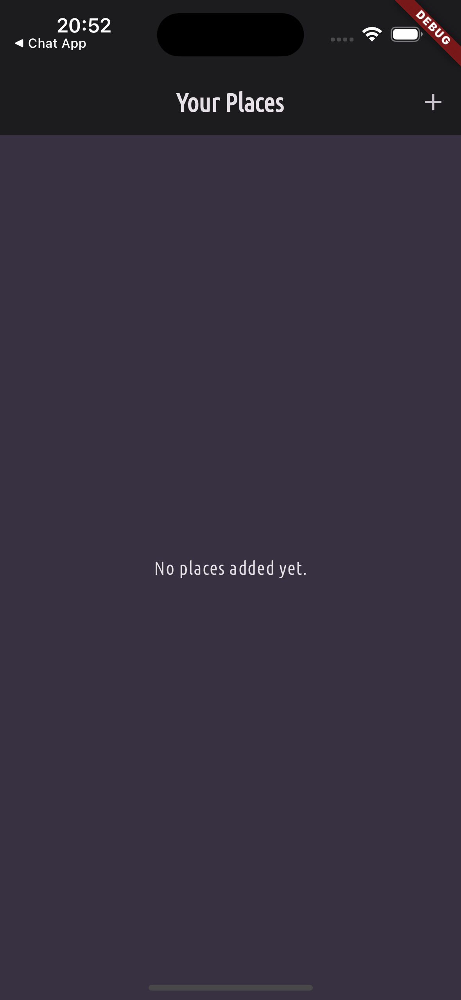
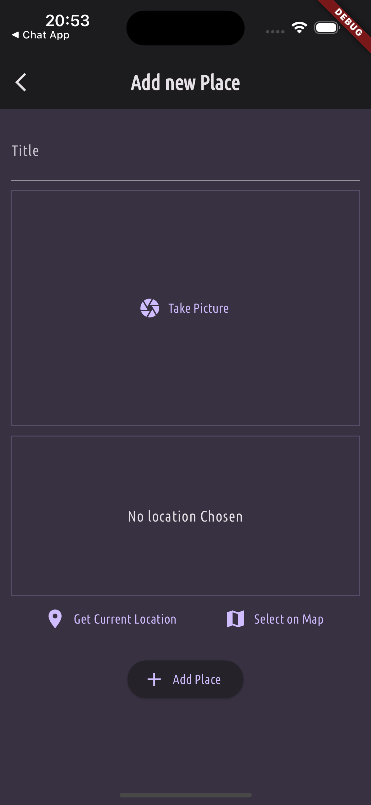
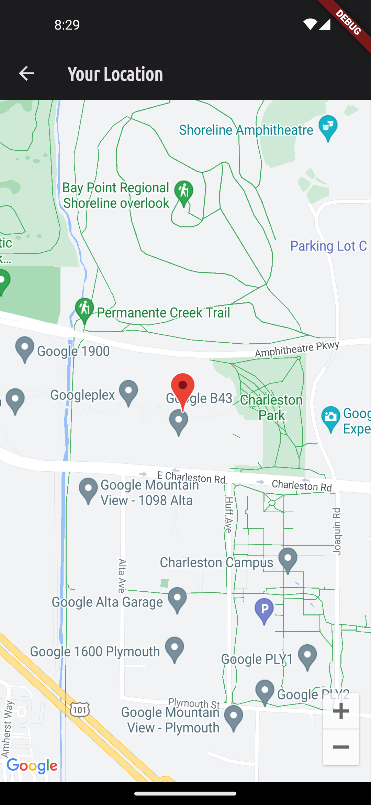
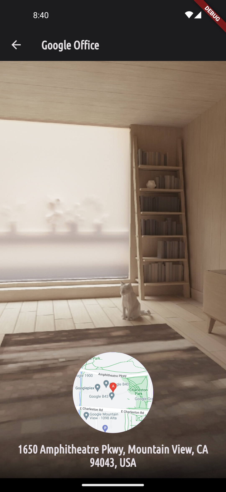

# favorite_places
- お気に入りの場所を登録するアプリ

## 画面仕様
一覧画面(0件時) | 一覧画面
--- | ---
 | 
No places added yet. と表示 「+」ボタンタップで追加画面に遷移 | 写真、タイトル、位置情報を表示 タップして詳細画面に遷移

追加画面 | 場所選択 | 詳細画面
--- | --- | ---
 |  | 
Title: 一覧画面に表示するタイトル Take Picture: タップでカメラを起動する No location chosen: 選択した位置を表示 Get Current Location: 現在地を取得 Select On Map: マップから場所を選択 | Select On Mapタップで表示 登録したい位置(場所)を選択 |  一覧画面から遷移 追加画面で追加した情報を表示
